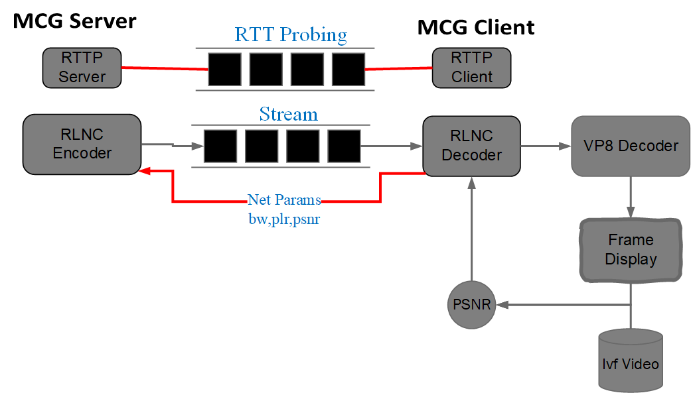

# Dependencies
This project uses kodo for FEC coding. 

To use kodo.cpython-36m-x86_64-linux-gnu.so, you need to set up a virtual envirnment with python 3.6

You also need to install libvpx-dev for video coding (VP8 encoding and decoding).

install libvpx and Pillow

```sudo apt-get update -y```

```sudo apt-get install -y libvpx-dev```

```python3 -m pip install --upgrade pip```

```python3 -m pip install --upgrade Pillow```

# Steps to run

- **Step1**:

Keep kodo.cpython-arch.so in the project dir, or copy it to /usr/lib/python3.6/
```sudo cp ~/path-to-kodo/kodo.cpython-36m-x86_64-linux-gnu.so /usr/lib/python3.6/```

You can copy this file to the same folder as your Python scripts, or you can copy it to where ```sys.path``` refers, or to your PYTHONPATH (so that you can import it from anywhere).
Then you can import the module in your Python script:
```import kodo```

- **Step2**:

Copy [ivf videos 1 min][1] or [ivf videos 10 min][2] folders to inout_data dir.
These folders contain vp8 encoded video videos which are stored as ivf files (conining frames' information and data)

- **Step3 (optional)**:

Apply delay and bandwidth restrictions on the link to match the desired network conditions.
You 'tc & netem' to restrict the link between client PC and server PC!

- **Step 4 (optional)**:

To run them from terminal, you need to add the root directory to PYTHONPATH:

```PYTHONPATH=$PYTHONPATH:/path/to/NebulaMCG/```

```export PYTHONPATH```

- **Step5 (Running client then server)**:

Run first MCGclient/MainClient.py on the client PC, then run MCGserver/MainServer.py on the server PC.


#### The prototype illustration
Where round trip time probing (RTTP), and ivf video refers to either [ivf videos 1 min][1] or [ivf videos 10 min][2]. 


<!--  -->

**The gaming prototype** <br>
The full prototype adds two components at the server, sceen capture and video encoding. The code pf this prototype is implemented under dir 


# System Performance 
**Bandwidth Utilization**<br>
Throughput of each connection with variation of the link bandwidth (grey). Nebula uses the bandwidth the most efficiently.
ESCOT and TCP Cubic tend to overshoot while WebRTC significantly undershoots. BO barely utilizes the available bandwidth


**Motion-to-photon Latency and visual quality (PSNR in dB)**<br>
 MTP latency, network RTT, and PSNR on emulated network<br>

MTP latency, network RTT, and PSNR over eduroam WiFi network <br>


# User QoE Performance
The articipants played Openarena game for two minutes for each streaming method. The order in which the participants experience each streaming solution follows the balanced latin square design to avoid learning and order effect.  After each run, the participants fill a short questionnaire on the perceived visual quality and playability on a 5-point Likert scale (1 - bad, 2 - poor, 3 - fair, 4 - good, 5 - excellent), and a simplified version of the NASA TLX survey considering the perceived mental demand, frustration, and success on a [0-20] scale. We do not disclose the streaming methods used in order not to affect the participants' ratings.

**questionnaire's QR Code** <br>
 
 
 **Users Perception** <br>
 Users’ perception of the gaming experience under traditional cloud gaming measures (left) and task load (right). 
 


[1]: https://www.dropbox.com/sh/0ad9g4m9ww6ro9z/AACdf4FxtMcdJ0mKwk3ee8Y0a?dl=0
[2]: https://www.dropbox.com/sh/j9lkhs1x331w9z0/AAB_wa7yR8fq0EJH91tpIdz3a?dl=0

